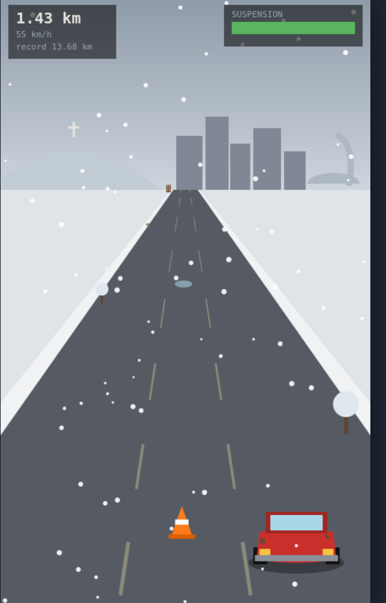
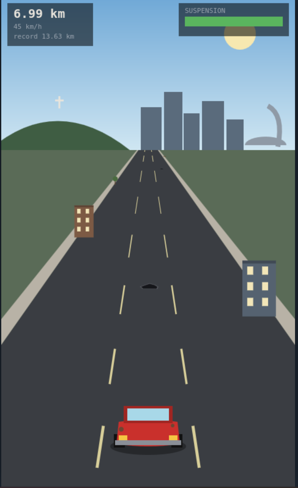
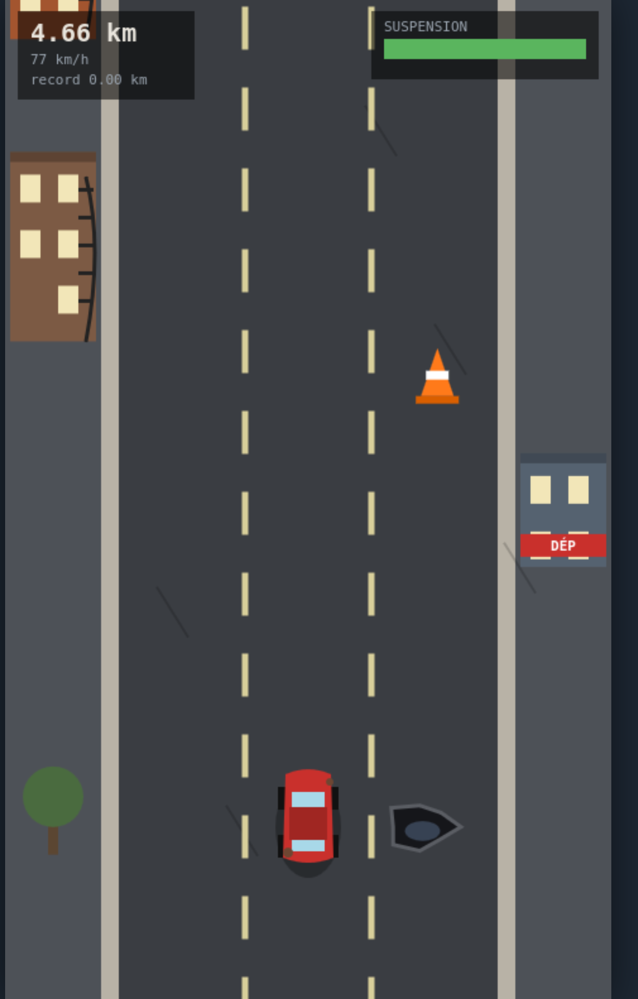
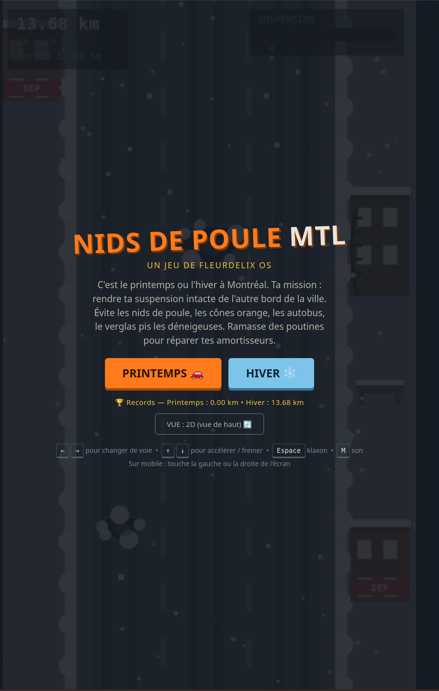
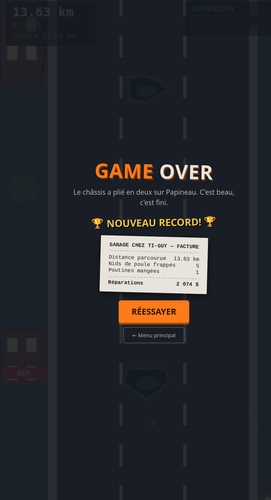

# 🚗 Nids de Poule MTL

> Un jeu d'arcade HTML5 où tu conduis dans les rues de Montréal en essayant de garder ta suspension en vie. Bonne chance.

C'est le printemps (ou l'hiver) à Montréal. Ta mission : traverser la ville en évitant les nids de poule, les cônes orange, les autobus, le verglas pis les déneigeuses. Ramasse des poutines en chemin pour réparer tes amortisseurs. Quand ta suspension rend l'âme, le Garage Chez Ti-Guy te remet la facture — main-d'œuvre incluse, évidemment.

**Un seul fichier HTML. Aucune dépendance. Aucune installation. Ça roule partout, même sur mobile.**

## 📸 Captures d'écran

| Menu principal | Vue 2D (de haut) |
|:---:|:---:|
|  |  |

| Vue 3D — Printemps | Vue 3D — Hiver |
|:---:|:---:|
|  |  |

| La facture du garage |
|:---:|
|  |

## 🎮 Jouer

Télécharge `nids-de-poule-mtl.html` et ouvre-le dans n'importe quel navigateur. C'est tout.

Tu peux aussi l'héberger avec GitHub Pages pour y jouer en ligne : active Pages dans les réglages du repo et le jeu sera accessible directement.

## 🕹️ Contrôles

| Touche | Action |
|---|---|
| `←` `→` | Changer de voie |
| `↑` `↓` | Accélérer / freiner |
| `Espace` | Klaxon 📯 |
| `M` | Couper / remettre le son |

**Sur mobile :** touche la moitié gauche ou droite de l'écran pour changer de voie. Les boutons 🏠 (menu) et 📯 (klaxon) sont en bas de l'écran pendant la partie.

## ✨ Caractéristiques

- **Deux saisons** au choix :
  - 🌧️ **Printemps** — nids de poule frais, cônes de construction, autobus
  - ❄️ **Hiver** — neige qui tombe, nids de poule *cachés sous la neige*, plaques de glace qui font déraper, déneigeuses, direction plus molle (t'as pas tes pneus d'hiver, faut croire)
- **Deux vues** commutables : 2D vue de haut, ou pseudo-3D rétro style *OutRun* avec la skyline de Montréal à l'horizon (mont Royal et sa croix, centre-ville, tour du Stade olympique)
- **Décor procédural montréalais** : duplex et triplex en brique avec escaliers en colimaçon, dépanneurs, slush sur les trottoirs
- **Sons 100 % synthétisés** avec l'API Web Audio — aucun fichier audio : "toung" de suspension, klaxons, dérapage, jingle de poutine, ronron de moteur qui suit ta vitesse, et le classique "womp womp" au game over
- **High scores séparés** par saison, sauvegardés dans le navigateur (`localStorage`)
- **Répliques québécoises** à chaque impact : « Ayoye! », « Maudite sloche! », « J'vais caller le 311! »
- **Facture de garage** détaillée à la fin — 385 $ par nid de poule frappé, parce que c'est comme ça

## 🔧 Sous le capot

Le jeu tient dans **un seul fichier HTML** sans aucune librairie externe :

- **Canvas 2D** pour tout le rendu, incluant la vue pseudo-3D (projection en perspective vers un point de fuite, technique des jeux de course des années 80)
- **Web Audio API** pour synthétiser tous les sons en temps réel (oscillateurs + bruit filtré)
- **localStorage** pour la persistance des records et de la vue préférée, avec repli gracieux si le stockage n'est pas disponible
- La logique du jeu est indépendante du rendu : les collisions et distances sont identiques en 2D et en 3D, donc les records restent comparables entre les deux vues

## 🗺️ Idées pour la suite

- [ ] Tempête de neige qui réduit la visibilité passé 5 km
- [ ] Niveaux nommés par rue (Sherbrooke → Sainte-Catherine → Notre-Dame)
- [ ] Mode nuit
- [ ] Tableau des scores en ligne

Les contributions sont les bienvenues — ouvre une *issue* ou une *pull request*!

## 📄 Licence

Ce projet est distribué sous licence [MIT](LICENSE). Fais-en ce que tu veux, mais si ton char frappe un vrai nid de poule, c'est pas ma faute.

## 🙏 Remerciements

- La Ville de Montréal, pour l'inspiration inépuisable
- Les nids de poule de la rue Papineau, consultants techniques

---

*Fait avec ❤️ (et un peu de frustration routière) par **Fleurdelix** — Montréal, 2026*
